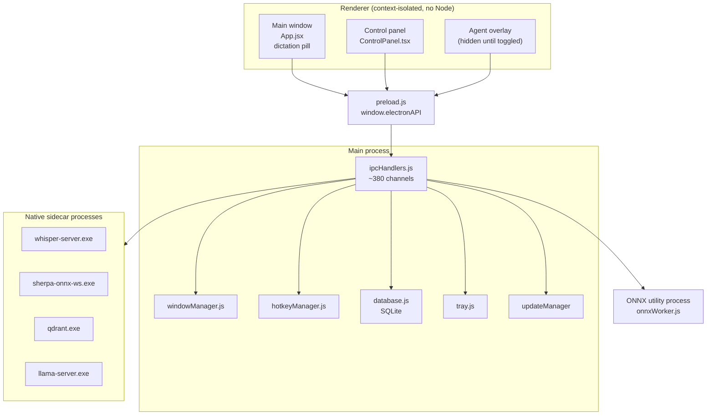

# Architecture

## Process model

Dhwani is a standard three-process Electron app plus one dedicated utility process for ONNX inference:

- **Main process** (`main.js`, `src/helpers/*.js`) — window lifecycle, IPC handler registration, hotkey
  registration, native sidecar process management (whisper.cpp, Parakeet/sherpa-onnx, Qdrant, llama.cpp
  server), SQLite database, tray, auto-updater.
- **Renderer process(es)** (`src/*.tsx`, `src/*.jsx`) — React 19 + TypeScript UI, one `BrowserWindow` per
  window role (see below), context-isolated with no direct Node access.
- **Preload script** (`preload.js`) — the only bridge between renderer and main, exposes a narrow
  `window.electronAPI` surface via `contextBridge`. Every renderer→main call goes through this file; there
  is no `nodeIntegration`.
- **ONNX utility process** (`src/workers/onnxWorker.js`, spawned by `src/helpers/onnxWorkerClient.js`) —
  hosts all `onnxruntime-node` inference (text embeddings for semantic search, speaker embeddings, VAD
  fbank features). Lazy-spawned on first use. Native crashes in ONNX confine to this process; main
  respawns it with backoff instead of crashing.

## Window architecture

Dhwani creates three `BrowserWindow`s from `windowManager.js`, all loading the same React bundle
(`AppRouter.jsx` routes by URL query param, not a router library — see `src/AppRouter.jsx`):

| Window | Created by | URL | Renders |
|---|---|---|---|
| Main / dictation overlay | `createMainWindow()` | `/` | `App.jsx` — the floating pill (idle circle → recording waveform), draggable, always-on-top, resizes per state via `resizeMainWindow(sizeKey)` |
| Control panel | `createControlPanelWindow()` | `/?panel=true` | `ControlPanel.tsx` — sidebar (Home/Insights/Dictionary/Snippets/Style/Transforms/Scratchpad/Chat/Notes/Upload/Integrations) + content + contextual right panel |
| Agent overlay | `createAgentWindow()` | `/?agent=true` | Hidden until toggled; chat-style agent interaction window |

Two additional lightweight overlay windows exist for transient UI: meeting-detection notifications
(`?meeting-notification=true`) and update notifications (`?update-notification=true`), plus a
transcription preview overlay (`?transcription-preview=true`).

The dictation overlay's size is state-driven, not fixed — `App.jsx` calls
`window.electronAPI.resizeMainWindow(sizeKey)` on every recording/menu/toast state change, and
`windowManager.resizeMainWindow()` (in `windowConfig.js` + `windowManager.js`) resolves the pixel size for
that key and repositions the window anchored to whichever corner `panelStartPosition` specifies
(bottom-left / bottom-center / bottom-right), expanding/collapsing in place rather than jumping.

## Module map (`src/helpers/`)

The main process is organized as one manager class per concern, all wired together in `main.js`. Selected
managers (see `CLAUDE.md` for the full list):

- **`windowManager.js`** — window creation, sizing, positioning, activation-mode cache
- **`hotkeyManager.js`** — named hotkey slots (`dictation`, `agent`, `voiceAgent`, `polish`, `meeting`,
  `pasteLastTranscript`), platform-specific registration (`globalShortcut`, native Windows key listener,
  GNOME/Hyprland/KDE D-Bus on Linux), fallback-on-conflict logic
- **`tray.js`** — system tray icon + context menu (dictation toggle, open control panel, check for
  updates, paste last transcript, shortcuts, Microphone/Languages submenus fed live from the renderer,
  help/support/feedback links, exit)
- **`database.js`** — `better-sqlite3` wrapper: transcriptions, notes, folders, agent conversations,
  dictionary, insights stats
- **`clipboard.js`** — cross-platform paste (Windows: PowerShell SendKeys / nircmd; macOS: AppleScript;
  Linux: native XTest binary → xdotool/wtype/ydotool fallback chain)
- **`environment.js`** — `.env` persistence in `userData`, `safeStorage`-encrypted secret keys
  (`userData/secure-keys/`), channel-scoped userData path (`Dhwani-development` / `-staging`, migrated
  from legacy `OpenWhispr-*` on first launch)
- **`modelDirUtils.js`** — single source of truth for the `~/.cache/dhwani` model/cache root (migrated
  from legacy `~/.cache/openwhispr` on first access)
- **`whisper.js` / `parakeet.js` / `parakeetServer.js`** — local ASR engines
- **`qdrantManager.js` / `localEmbeddings.js` / `vectorIndex.js`** — local semantic search sidecar
- **`ipcHandlers.js`** — the single large class registering nearly all `ipcMain` handlers (see
  [ipc-reference.md](ipc-reference.md))

## Storage

- **SQLite** (`database.js`, via `better-sqlite3`) — transcriptions, notes/folders, agent conversations,
  custom dictionary. Lives in `userData/`.
- **Qdrant** (sidecar binary) — vector index for local semantic note search. Data at
  `~/.cache/dhwani/qdrant-data/`.
- **`safeStorage`-encrypted secrets** — BYOK API keys + enterprise cloud credentials, one file per key
  under `userData/secure-keys/`, delegating to the OS keychain (DPAPI on Windows).
- **`.env` in `userData`** — non-secret persisted settings (hotkeys, provider selection, feature flags).
- **`~/.cache/dhwani/`** — downloaded model weights (whisper-models, parakeet-models, embedding-models),
  Qdrant data. Shared cache root, not per-channel.
- **`~/.dhwani/cli-bridge.json`** — loopback bridge token for the CLI-to-desktop-app connection (ports
  8200–8219, 127.0.0.1-only).

## Renderer structure

- **State**: Zustand stores in `src/stores/` (`transcriptionStore`, `settingsStore`, `noteStore`,
  `meetingRecordingStore`, …).
- **Styling**: Tailwind CSS v4 via `@tailwindcss/vite`, no `tailwind.config.js` — theme tokens live in
  `src/index.css`'s `@theme` block. shadcn/ui primitives (`src/components/ui/`) on Radix.
- **i18n**: react-i18next, 10 locales (`src/locales/{lang}/translation.json`), `fallbackLng: "en"` so
  untranslated strings degrade to English rather than showing raw keys.
- **Build**: Vite 8 (rolldown), dev server on port 5183, `base: "./"` for `file://` loading in production.
