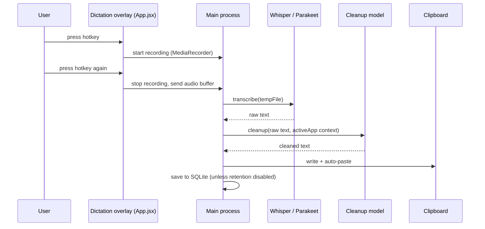
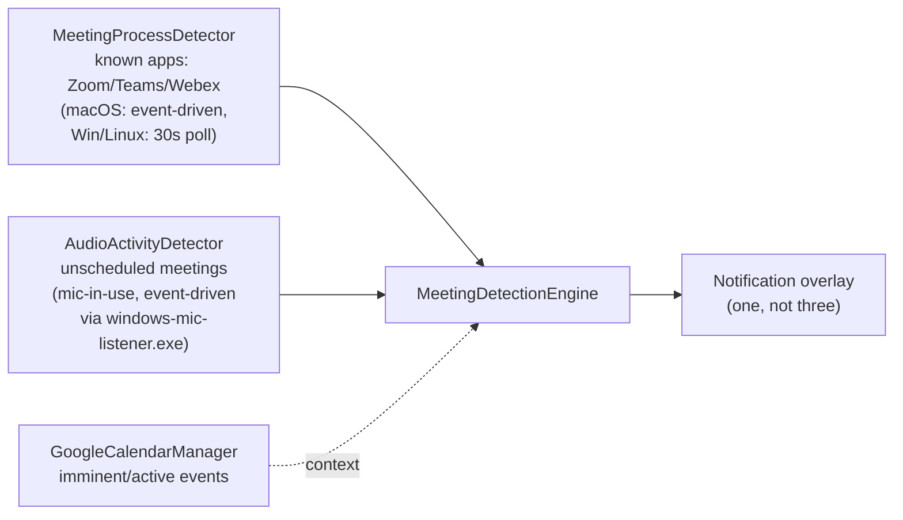
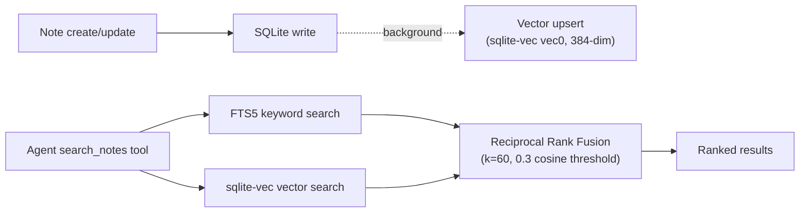

# Data Flow

## Dictation pipeline (standard, non-streaming)

1. User presses the dictation hotkey (default `Control+Super` on Windows, registered via
   `hotkeyManager.js`).
2. `windowManager` shows the dictation overlay; `useAudioRecording.js` starts `MediaRecorder` via
   `AudioManager` (`src/helpers/audioManager.js`).
3. User presses the hotkey again (tap-to-toggle) or releases it (push-to-talk) → recording stops.
4. Audio `Blob` → `ArrayBuffer` → sent over IPC to the main process → written to a temporary file.
5. The active local engine (whisper.cpp `whisper-server.exe` or Parakeet `sherpa-onnx-ws.exe`) or a cloud
   provider transcribes the file. Temp file is deleted after processing.
6. If a cleanup model is configured, the raw transcript is sent through the LLM cleanup pipeline (adds
   punctuation, fixes filler words, optionally applies the `{{activeApp}}`-aware prompt so cleanup style
   adapts to the app you're dictating into).
7. Final text is copied to the clipboard and auto-pasted at the cursor (`clipboard.js`), and saved to the
   transcriptions table (`database.js`) unless data retention is disabled.

## Live typing (streaming, opt-in)

Live typing types at the cursor while you're still speaking, instead of waiting for the full recording to
stop. It reuses the same realtime-preview transcription pipeline as standard dictation, but chunks are cut
only at detected silence pauses (`src/helpers/liveTypingCut.js`), and injection happens via
`windows-fast-paste.exe --type` (SendInput unicode) instead of a single clipboard paste at the end.

- Silence detection is RMS-based, calibrated per-mic (`silenceRms` threshold, default 0.015 — pause noise
  floor is typically 0.0005–0.008, speech 0.02–0.09).
- The key listener ignores `LLKHF_INJECTED` events so a physical push-to-talk key release isn't confused
  with the app's own synthetic key injection.
- The final high-quality pass still runs and is what gets saved to history; the live-typed text is a
  best-effort streaming preview, not the source of truth.

## Meeting detection

Three independent, event-driven signal sources feed `MeetingDetectionEngine`
(`src/helpers/meetingDetectionEngine.js`), which coalesces them into a single notification:

Rules: all notifications are suppressed while actively recording (tap or push-to-talk); a 2.5s
post-recording cooldown avoids a notification flashing right after you finish dictating; process detection
takes priority over audio detection when both fire, so exactly one notification shows.

## Paste path

`clipboard.js`'s `pasteText(text, options)` is the single entry point used by both the end-of-dictation
paste and the tray/hotkey-triggered "Paste last transcript" feature
(`main.js`'s `pasteLastTranscriptCallback`, reading `databaseManager.getTranscriptions(1)`). Platform
dispatch:

- **Windows**: PowerShell `SendKeys`, or bundled `nircmd.exe` as fallback; `windows-fast-paste.exe`
  (SendInput) for the live-typing streaming path specifically.
- **macOS**: AppleScript (requires Accessibility permission); falls back to clipboard-only with a manual
  paste prompt if permission is denied.
- **Linux**: native XTest binary first (works on X11 and XWayland), then xdotool/wtype/ydotool depending
  on compositor.

## Local semantic search

Always-on, offline. Vectors live in `vec0` (sqlite-vec) virtual tables inside the app's SQLite database —
no separate process. The `all-MiniLM-L6-v2` embedding model runs in the ONNX utility process and
auto-downloads on first use if missing.

If the sqlite-vec extension fails to load, search silently falls back to FTS5 keyword search only —
semantic search is a progressive enhancement, not a hard dependency, for the agent's note search.
